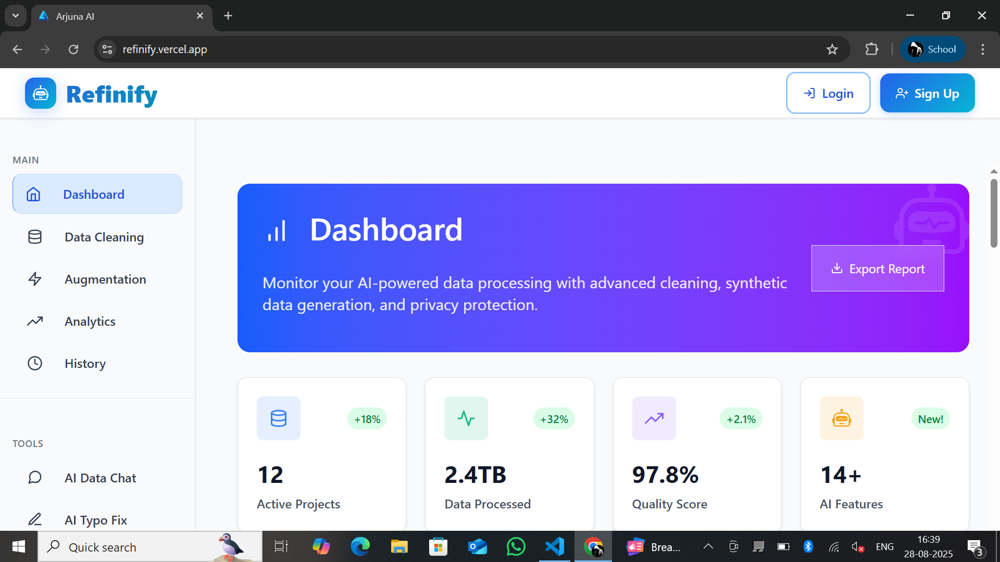

# 🏥 HealthCare Management System

A comprehensive healthcare management platform with AI-powered features for patients, doctors, and administrators. This full-stack application provides medical record management, AI-assisted diagnosis, real-time vitals monitoring, and telemedicine capabilities.



## 🌟 Features

### 👤 **Patient Features**
- **Dashboard Overview**: Personal health metrics and quick actions
- **Medical Records Management**: Upload, view, and manage medical documents
- **AI Symptom Checker**: Intelligent symptom analysis with recommendations
- **Real-time Vitals Monitor**: Track heart rate, blood pressure, temperature, and oxygen saturation
- **Medical Chat Assistant**: AI-powered medical consultation
- **Medical Image Analysis**: AI analysis of medical images (X-rays, skin lesions, etc.)
- **AI Mental Health Monitor**: Advanced depression/stress detection using text, voice, and facial analysis
- **Relaxation Exercises**: Guided breathing, meditation, and stress relief techniques
- **Health Recommendations**: Personalized health tips and wellness advice
- **Appointment Scheduling**: Book appointments with doctors
- **File Upload Support**: Upload medical documents (PDF, images)

### 👨‍⚕️ **Doctor Features**
- **Patient Management**: View and manage assigned patients
- **Medical Records Review**: Review and verify patient records
- **AI Analysis Integration**: Access AI-generated insights for patient records
- **Prescription Management**: Create and manage patient prescriptions
- **Record Verification**: Approve and validate medical records
- **Patient Communication**: Access patient information and history

### 👨‍💼 **Admin Features**
- **System Overview**: Comprehensive dashboard with key metrics
- **User Management**: Manage patients, doctors, and system users
- **System Analytics**: User distribution and activity analytics
- **System Health Monitoring**: Monitor database, API, and AI services status
- **User Role Management**: Control access levels and permissions

## 🛠️ Tech Stack

### **Backend**
- **Framework**: Flask (Python)
- **Database**: SQLite3
- **Authentication**: Session-based authentication with secure password hashing
- **API**: RESTful API design
- **CORS**: Flask-CORS for cross-origin requests
- **File Handling**: Secure file upload and storage
- **Password Security**: SHA-256 hashing

### **Frontend**
- **Framework**: React 19.1.1
- **Build Tool**: Vite 7.1.2
- **Styling**: Tailwind CSS 4.1.12
- **Icons**: Heroicons React
- **State Management**: React Hooks (useState, useEffect)
- **HTTP Client**: Fetch API
- **Development**: Hot reload with Vite dev server

### **Development Tools**
- **Linting**: ESLint with React plugins
- **CSS Processing**: PostCSS with Autoprefixer
- **Package Management**: npm
- **Version Control**: Git

### **AI & Analytics Features**
- **Symptom Analysis**: Mock AI symptom checker with confidence scoring
- **Image Analysis**: Medical image processing and analysis
- **Mental Health AI**: Text sentiment analysis, voice tone detection, facial expression recognition
- **Stress Detection**: Real-time stress and mood monitoring with personalized interventions
- **Relaxation Therapy**: Guided breathing exercises, progressive muscle relaxation, mindfulness techniques
- **Health Recommendations**: Personalized health tips engine
- **Vitals Monitoring**: Real-time health metrics simulation
- **Medical Chat**: AI-powered medical assistant

## 📁 Project Structure

```
HealthCare/
├── backend/
│   ├── app.py              # Main Flask application
│   ├── database.py         # Database initialization and management
│   ├── healthcare.db       # SQLite database file
│   ├── main.py            # Application entry point
│   ├── requirements.txt    # Python dependencies
│   └── uploads/           # File upload directory
├── frontend/
│   ├── public/
│   │   └── vite.svg       # Vite logo
│   ├── src/
│   │   ├── components/    # React components
│   │   │   ├── AdminDashboard.jsx
│   │   │   ├── Dashboard.jsx
│   │   │   ├── DoctorDashboard.jsx
│   │   │   ├── HealthRecommendations.jsx
│   │   │   ├── ImageAnalysis.jsx
│   │   │   ├── Login.jsx
│   │   │   ├── MedicalChat.jsx
│   │   │   ├── MentalHealthMonitor.jsx
│   │   │   ├── PatientDashboard.jsx
│   │   │   ├── RelaxationExercises.jsx
│   │   │   ├── Sidebar.jsx
│   │   │   ├── SymptomChecker.jsx
│   │   │   └── VitalsMonitor.jsx
│   │   ├── App.jsx        # Main React component
│   │   ├── App.css        # Application styles
│   │   ├── index.css      # Global styles
│   │   └── main.jsx       # React entry point
│   ├── package.json       # Node.js dependencies
│   ├── tailwind.config.js # Tailwind CSS configuration
│   ├── vite.config.js     # Vite configuration
│   └── eslint.config.js   # ESLint configuration
└── README.md              # Project documentation
```

## 🚀 Installation & Setup

### Prerequisites
- Python 3.8+
- Node.js 16+
- npm or yarn

### Backend Setup

1. **Navigate to backend directory**
   ```bash
   cd backend
   ```

2. **Install Python dependencies**
   ```bash
   pip install -r requirements.txt
   ```

3. **Initialize the database**
   ```bash
   python database.py
   ```

4. **Start the Flask server**
   ```bash
   python app.py
   ```
   The backend will run on `http://localhost:8000`

### Frontend Setup

1. **Navigate to frontend directory**
   ```bash
   cd frontend
   ```

2. **Install Node.js dependencies**
   ```bash
   npm install
   ```

3. **Start the development server**
   ```bash
   npm run dev
   ```
   The frontend will run on `http://localhost:5173`

## 🔐 Default Login Credentials

### Admin Account
- **Email**: `admin@healthcare.com`
- **Password**: `admin123`

### Doctor Account
- **Email**: `doctor@healthcare.com`
- **Password**: `doctor123`

### Patient Account
- Register a new patient account through the registration form

## 🗄️ Database Schema

### Users Table
- `id` (Primary Key)
- `email` (Unique)
- `password` (Hashed)
- `role` (patient/doctor/admin)
- `name`
- `phone`
- `created_at`

### Medical Records Table
- `id` (Primary Key)
- `patient_id` (Foreign Key)
- `doctor_id` (Foreign Key)
- `record_type`
- `title`
- `description`
- `file_path`
- `ai_analysis`
- `status`
- `created_at`

### Appointments Table
- `id` (Primary Key)
- `patient_id` (Foreign Key)
- `doctor_id` (Foreign Key)
- `appointment_date`
- `status`
- `notes`
- `created_at`

### Prescriptions Table
- `id` (Primary Key)
- `patient_id` (Foreign Key)
- `doctor_id` (Foreign Key)
- `medication`
- `dosage`
- `instructions`
- `created_at`

## 🔌 API Endpoints

### Authentication
- `POST /api/register` - User registration
- `POST /api/login` - User login
- `POST /api/logout` - User logout

### Patient Endpoints
- `GET /api/patient/records` - Get patient records
- `POST /api/patient/records` - Upload new record
- `GET /api/patient/appointments` - Get appointments
- `POST /api/patient/appointments` - Schedule appointment

### Mental Health Endpoints
- `POST /api/mental-health/analyze-text` - Analyze text sentiment for mood detection
- `POST /api/mental-health/analyze-voice` - Analyze voice tone and stress levels

### Doctor Endpoints
- `GET /api/doctor/patients` - Get assigned patients
- `GET /api/doctor/records` - Get records for review
- `POST /api/doctor/verify-record` - Verify patient record
- `POST /api/doctor/prescriptions` - Add prescription

### Admin Endpoints
- `GET /api/admin/users` - Get all users
- `GET /api/admin/stats` - Get system statistics

## 🎨 UI/UX Features

- **Responsive Design**: Works on desktop, tablet, and mobile devices
- **Modern Interface**: Clean, intuitive design with Tailwind CSS
- **Role-based Dashboards**: Customized interfaces for each user type
- **Real-time Updates**: Live vitals monitoring and chat features
- **File Upload**: Drag-and-drop file upload with preview
- **Interactive Charts**: Health metrics visualization
- **Loading States**: Smooth loading animations and states
- **Error Handling**: User-friendly error messages

## 🔒 Security Features

- **Password Hashing**: SHA-256 encryption for user passwords
- **Session Management**: Secure session-based authentication
- **Role-based Access**: Different access levels for users
- **File Upload Security**: Restricted file types and size limits
- **CORS Protection**: Configured cross-origin resource sharing
- **Input Validation**: Server-side validation for all inputs

## 🚀 Future Enhancements

- **Real AI Integration**: Connect with actual AI/ML services
- **Video Consultations**: Telemedicine video calling
- **Mobile App**: React Native mobile application
- **Payment Integration**: Billing and payment processing
- **Advanced Analytics**: Detailed health analytics and reporting
- **Multi-language Support**: Internationalization
- **Cloud Storage**: AWS S3 integration for file storage
- **Push Notifications**: Real-time notifications
- **Electronic Health Records**: Full EHR compliance
- **Integration APIs**: Third-party medical device integration

## 🤝 Contributing

1. Fork the repository
2. Create a feature branch (`git checkout -b feature/AmazingFeature`)
3. Commit your changes (`git commit -m 'Add some AmazingFeature'`)
4. Push to the branch (`git push origin feature/AmazingFeature`)
5. Open a Pull Request

## 📝 License

This project is licensed under the MIT License - see the [LICENSE](LICENSE) file for details.

## 👥 Team

- **Developer**: Healthcare Management System Team
- **Contact**: healthcare@example.com

## 🙏 Acknowledgments

- React community for excellent documentation
- Flask community for robust backend framework
- Tailwind CSS for beautiful styling system
- Healthcare professionals for domain expertise

---

**Note**: This is a demonstration project with mock AI features. For production use, integrate with real AI/ML services and ensure compliance with healthcare regulations (HIPAA, GDPR, etc.).